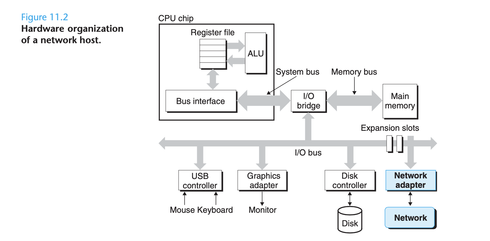
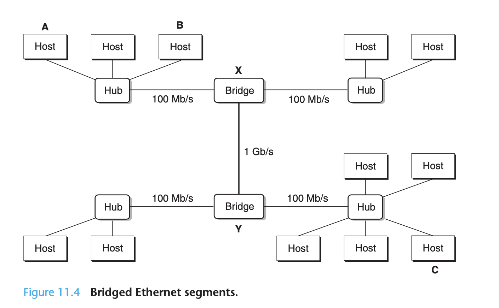
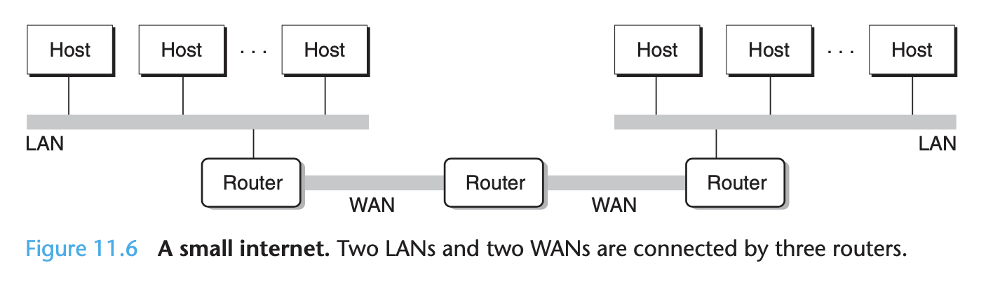
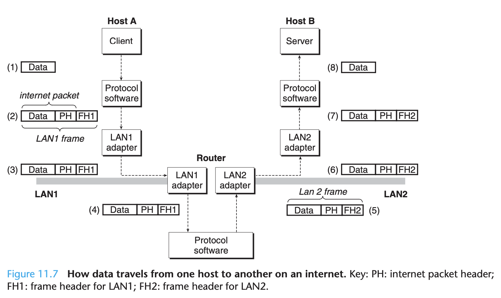
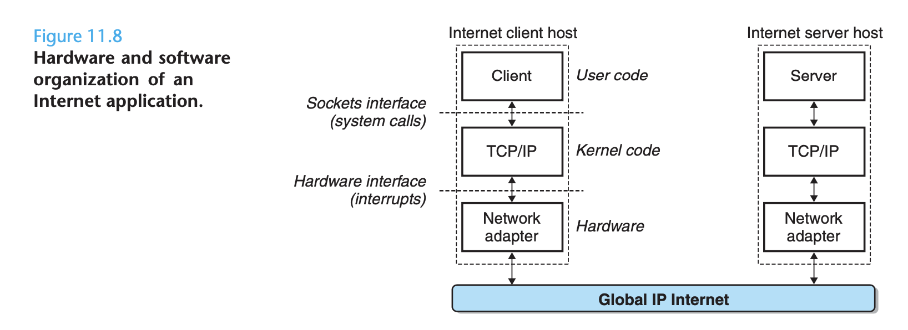

# Network Programming

## The client-server programming model

Every network app is based on the *client-server model*. With this model,
an app consists of a *server* process and one or more *client* processes. A
server manages some *resource*, and it provides some *service* for it clients
by manipulating that resource. For ex, a web server manages a set of disk files
that it retrieves and executes on behalf of clients. An ftp server manages
a set of disk files that it stores and retrieves for clients. Similarly,
an email server manages a spool file that it reads and updates for clients.

The fundamental operation in the client-server model is the *transaction*.
A client-server transaction consists of 4 steps:
1. When a client needs a service, it initiates a transaction by sending a
   *request* to the server. ex: Web browser needs a file, it sends a request
   to a web server.
2. The server receives the request, interprets it, and manipulates its resources
   in the appropriate way. ex: a web server receives a request from a browser, it reads a disk file.
3. The server sends a *response* to the client and then waits for the next
   request. For ex: a web server sendss the file back to a client.
4. The client receives the response and manipulates it. ex: a browser receives
   the page from the server and then displays it on the screen.

*Client-server transactions vs database transactions*

Client-server transactions are not database transactions and do not share
any of their properties, such as atomicity. In our context, a transaction
is simply a sequence of steps carried out by a client and a server.

It is important to realize that clients and servers are processes and not
machines, or *hosts* as they are often called in this context. A single host
can run many different clients and servers concurrently, and a client and server
transaction can be on the same or different hosts. The client-server model is the
same regardless of the mapping of clients and servers to hosts.

## Networks
Clients and servers run on separate hosts and communicate using the hardware
and software resources of a *computer network*.

To a host, a network is just another I/O device that serves as a source and
sink for data.

An adapter plugged into an expansion slot on the I/O bus provides the physical interface to the
network. Data received from the network are copied from the adapter across the I/O and memory
buses into memory, typically by DMA transfer. Similarly, data can also be copied from memory to
the network.

Physically a network is a hiearchical system that is organized by geographical proximity. At the
lowest level is a LAN (local area network) that spans a building or a campus. The most popular LAN
technology by far is *Ethernet*, which was developed in the mid-1970s at Xerox PARC. Ethernet
has proven to be remarkably resilient, evolving from 3 Mb/s to 10 GB/s.

An *Ethernet segment* consists of some wires (usually twisted pairs of wires) and a small box
called a *hub*. Ethernet segments typically span small areas, such as a room or a floor in a building.
Each wire has the same maximum bit bandwith, typically 100 Mb/s or 1 GB/s. One end is attached to
an adapter on a host, and the other end is attached to a *port* on the hub. A hub slavishly
copies every bit that it receives on each port to every other port. Thus, every host sees every bit.

Each Ethernet adapter has a globally unique 48-bit addresss that is stored in a nonvolatile memory
on the adapter. A host can send can send a chunk of bits called a *frame* to any other host on the
segment. Each frame includes some fixed number of *header* bits that identify the source and destination
of the frame and the frame length, followed by a *payload* of data bits. Every host adapter sees the
frame, but only the destination host actually reads it.

Multiple Ethernet segments can be connected into larger LANs, called *bridged Ethernets*, using a set
of wires and small bozes called *bridges*. Bridged Ethernets can span entire buildings or campuses.
In a bridged Ethernet, some wires connect bridges to bridges, and others connect bridges to
hubs. The bandwidth of the wires can be different.

Bridges make better use of the available wire bandwidth than hubs. Using a clever distributed
algorithm, they automatically learn over time which hosts are reachable from which ports and
then selectively copy frames from 1 port to another only when it is necessary. For ex, if host
A sends a frame to host B, which is on the segment, then bridge X will throw away the frame
when it arrives at its input port, thus saving bandwidth on the other segments. However, if host
A sends a frame to host C on a different segment, then bridge X will copy the frame only to
the port connected to bridge Y, which will copy the frame only to the port connected to host
C's segment.

At a higher level in the hierarchy, multiple incompatible LANs can be connected by specialized
computers called *routers* to form an *internet* (interconnected network). Each router has an
adapter (port) for each network that it is connected to. Routers can also connect high-speed
point-to-point phone connections, which are examples of networks known as WANs (wide area
networks), so called because they span larger geographical areas than LANs. In general, routers
can be used to build internets from arbitrary collections of LANs and WANs.

The crucial property of an internet is that it can consist of different LANs and WANs with
radically different and imcompatible technologies. Each host is physically connected to every
other host, but how is it possible for some source host to send data bits to another desitination
host across all of these incompatible networks?

The solution is a layer of *protocol software* running on each host and router that smoothes
out the differences between the different networks. This software implements a *protocol* that
governs how hostss and routers cooperate in order to transfer data. The protocol must provide
2 basic capabilities:

*Naming scheme*

Different LAN technologies have different and incompatible ways of assigning addresses to
hosts. The internet protocol smoothes these differences by defining a uniform format for
host addressses. Each host is then assigned at least one of these *internet addresses* that
uniquely identifies it.

*Delivery mechanism*

Different networking technologies have different and incompatible ways of encoding bits
on wires and of packaging these bits into frames. The internet protocol smoothes these
differences by defining a uniform way to bundle up data bits into discrete chunks called
*packets*. A packet consists of a *header*, which contains the packet size and addresses
of the source and destination hosts, and a *payload*, which contains data bits sent from
the source host.

Above, consists of 2 LANs connected by a router. A client on host A, which is attached
to LAN1, sends a sequence of data bytes to a server running on host B, which is attached
to LAN2. There are 8 basic steps:

1. The client on host A invokes a system call that copies the data from the client's
   virtual address space into a kernel buffer.
2. The protocol software on host A creates a LAN1 frame by appending an internet header
   and a LAN1 frame header to the data. The internet header is addressed to internet
   host B. The LAN1 frame header is addressed to the router. It then passes the frame
   to the adapter. Notice that the payload of the LAN1 frame iss an internet packet,
   whose payload is the actual user data. This kind of encapsulation is one of the
   fundamental insights of internetworking.
3. The LAN1 adapter copies the frame to the network.
4. When the frame reaches the router, the router's LAN1 adapter reads it from the wire
   and passes it to the protocol software.
5. The router fetches the destination internet address from the internet packet header
   and uses this as an index into a routing table to determine where to forward the packet,
   which in this case is LAN2. The router then strips off the old LAN1 frame header, prepends
   the new LAN2 frame header addressed to host B, and passes the resulting frame to the adapter.
6. The router's LAN2 adapter copies the frame to the network.
7. When the frame reaches host B, its adapter reads the frame from the wire and passes
   it to the protocol software.
8. Finally, the protocol software on host B strips off the packet header and frame header.
   The protocol software will eventually copy the resulting data into the server's virtual
   address space when the server invokes a system call that reads the data.

Questions:

* What if different networks have different maximum frame sizes?
* How do routers know where to forward frames?
* How are routers informed when the network topology changes?
* What if a packet gets lost?

## The Global IP Internet

Each Internet host runs software that implements the *TCP/IP* protocol
(*Transmission Control Protocol/Internet Protocol*), which is supported
by almost every modern computer system. Internet clients and servers communicate
using a mix of *sockets interface* functions and Unix I/O functions. The
sockets functionss are typically implemented as system calls that trap
into the kernel and call various kernel-mode functions in TCP/IP.

TCP/IP is actually a family of protocols, each of which contributes different
capabilities. For ex, IP provides the basic naming scheme and a delivery mechanism
that can send packets, known as *datagrams*, from 1 Internet host to any other
host. The IP mechanism is unreliable in the sense that it makes no effort to
recover if datagrams are lost or duplicated in the network. UDP (unreliable Datagram Protocol)
extends IP slightly, so that datagrams can be transferred from process to process,
rather than host to host. TCP is a complex protocol that buildss on IP to provide
reliable full duplex (bidirectional) *connections* between processes.

From a programmer's perspective, we can think of the Internet as a worldwide
collection of hosts with the following properties:
* the set of hosts is mapped to a set of 32-bit *IP addresses*.
* the set of of IP addresses is mapped to a set of identifiers called
  *Internet domain names*.
* a provesss on one Internet host can communicate with a process on any other
  Internet host over a *connection*.

*IPv4 and IPv6*

The original Internet protocol, with its 32-bit addresses, is known as Internet
protocol version 4 (IPv4). In 1996, the Internet Engineering Task Force (IETF)
proposed a new version of IP, called Internet protocol version 6 (IPv6), that uses
128-bit addresses and that was intended as the successor to IPv4. However, as of
2015, the vast majority of internet traffic is still carried by IPv4 networks.

### IP Addresses
An IP address is an unsigned 32-bit integer. Network programs store IP addresses
in the *IP address structure*. **netpfragments.c line 3**

Because Internet hosts can have different host byte orders, TCP/IP defines a
uniform *network byte order* (big-endian byte order) for any integer data item,
such ass an IP address, that is carried across the network in a packet header.
Addresses in IP address structures are always stored in (big-endian) network byte
order, even if the host byte order is little-endian. Unix provides the following
functions for converting between network and host byte order. **netpfragments.c line 7**

IP addresses are typically presented to humans in a form known as *dotted decimal notation*,
where each byte is represented by its decimal value and separated from the other bytes
by a period. For ex, `128.2.194.242` is the dotted-decimal representation of the
address `0x8002c2f2`. 

On Linux systems, you can use the `HOSTNAME` command to determine the dotted-decimal
address of your own host. `hostname -i`

Application programs can convert back and forth between IP addresses and dotted-decimal
strings using the functions `inet_pton` and `inet_ntop`. **netpfragments.c line 14**

